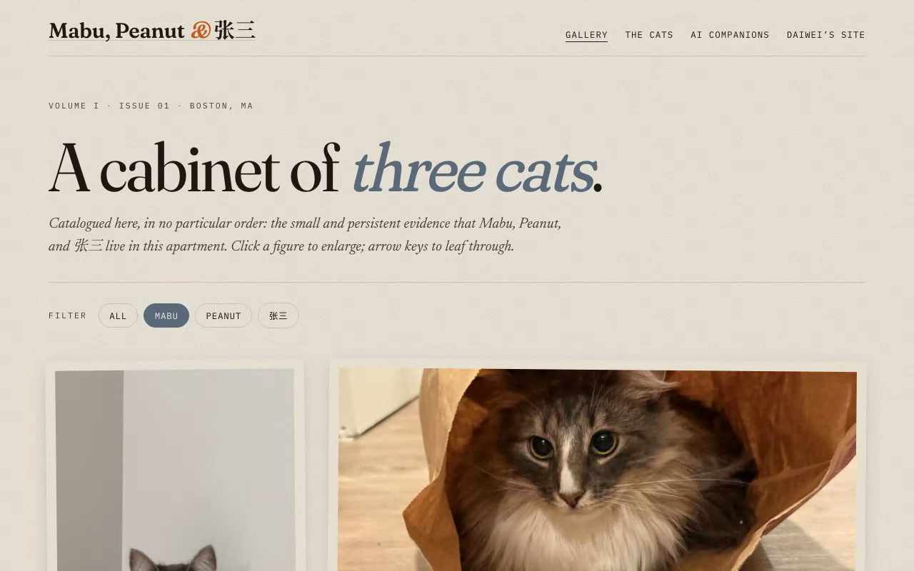

# Daiwei Zhang — Personal Home Page

Source for **<https://zdwww.github.io>** — my personal home page, submitted
as **Project 1** for Northeastern's Web Development course.

The site has two halves, both shipped from this repository:

1. **Academic homepage** at `/` — research, publications, CV, talks, and
   a `/personal/` page with side interests. Built on the
   [Academic Pages](https://github.com/academicpages/academicpages.github.io)
   Jekyll template.
2. **A Cabinet of Three Cats** at [`/project1/`](./project1/) — a small,
   self-contained vanilla HTML5 / CSS3 / ES6+ photo archive of my three
   cats. Hand-authored from scratch with no framework, no jQuery, and no
   component libraries. This is where the rubric's strict technical
   requirements (ES6 modules, an original JS component, an AI-generated
   page, semantic markup, Prettier + ESLint, MIT license) are satisfied.

The two halves cross-link: `/personal/` has a "Cabinet of Cats" card that
opens into `/project1/about.html`, and every page in `/project1/` links
back to the academic site at `/`.

---

## Project objective

Build a personal home page that (a) actually introduces who I am — a
PhD student doing 3D vision / Gaussian-Splatting research — and (b)
satisfies the Project 1 rubric end-to-end:

- vanilla HTML5 / CSS3 / ES6+, no jQuery, no component libraries
- ES6 modules with `type: "module"` in `package.json` and
  `<script type="module">` in every HTML page
- at least two HTML pages with different URLs, plus a third **AI-generated**
  page
- an **original JS component** > 5 lines
- CSS / JS / images organized into separate folders, no `!important`,
  Bootstrap 5+ or flexbox for layout
- `<meta>` author / description / icon on every page, all `` tags
  carry `alt` text, no `<div>`-buttons
- Prettier-formatted, ESLint-clean, W3C-clean (zero errors)
- `package.json`, MIT `LICENSE`, this README

The academic portion at `/` covers "is it a good homepage with meaningful
information." The vanilla portion at `/project1/` covers every other
strict requirement.

---

## Screenshot

A short animated walkthrough of the home page and the cat archive:


_Static fallback: [`./screenshot.png`](./screenshot.png)._

---

## Tech requirements

| Layer       | Academic homepage (`/`)        | Cat archive (`/project1/`)                                                                |
| ----------- | ------------------------------ | ----------------------------------------------------------------------------------------- |
| Markup      | Jekyll templates → HTML5       | Hand-written **HTML5** with semantic landmarks + native `<dialog>`                        |
| Styling     | Bootstrap 5.3 + SCSS           | **CSS3** only — variables, Grid, Flexbox, `prefers-reduced-motion`; **zero** `!important` |
| Scripting   | Bootstrap's bundled JS         | **ES6+** in native `<script type="module">`, `requestAnimationFrame`, `CustomEvent`       |
| Build chain | Ruby + Jekyll + Bundler        | **No build** — files served as-is                                                         |
| Dev tools   | Jekyll, Bundler                | Prettier 3.x, ESLint 9.x flat config (legacy 8.x `.eslintrc.json` retained for graders)   |
| Fonts       | Default theme fonts            | Google Fonts: Fraunces, Newsreader, IBM Plex Mono, Noto Serif SC (CJK)                    |
| Assets      | Site images + files            | Hand-shot cat photographs (`.jpg`), AI-generated `.webp` spritesheets, `.svg` favicon     |

**Browser support.** Tested on the latest Chrome, Firefox, and Safari on
macOS. The vanilla submission relies on the native `<dialog>` element
(baseline-supported across all modern browsers, 2023+).

**What is _not_ used anywhere in `/project1/`** — jQuery, React, Vue,
Tailwind, Bootstrap, any bundler (Vite/webpack/Rollup), any CSS
preprocessor, any `!important` declaration, any `<div>` button.

---

## How to install / use

### Just view it

Open <https://zdwww.github.io> in any modern browser. No install.

### Run the whole site locally (Jekyll + project1)

```bash
git clone https://github.com/zdwww/zdwww.github.io.git
cd zdwww.github.io

# Ruby + Jekyll (matches GitHub Pages)
bundle install
bundle exec jekyll serve
# → http://localhost:4000          (academic homepage)
# → http://localhost:4000/project1/ (cat archive)
```

Jekyll copies the contents of `project1/` through to `_site/` unchanged,
so production and local behave identically.

### Run only the cat archive (no Ruby needed)

```bash
cd project1
python3 -m http.server 8080
# → http://localhost:8080/
```

### Run the dev tools on `/project1/`

```bash
cd project1
npm install
npm run format       # Prettier writes
npm run format:check # Prettier check only
npm run lint         # ESLint flat config on js/
```

---

## Pages

| URL                          | Source                            | Description                                                                                              |
| ---------------------------- | --------------------------------- | -------------------------------------------------------------------------------------------------------- |
| `/`                          | Jekyll                            | Academic landing page                                                                                    |
| `/publications/`             | Jekyll                            | Publications list                                                                                        |
| `/cv/`                       | Jekyll                            | Curriculum vitae                                                                                         |
| `/talks/`                    | Jekyll                            | Talks                                                                                                    |
| `/personal/`                 | `_pages/personal.html`            | Side interests; links into the cat archive                                                               |
| `/project1/`                 | `project1/index.html`             | **Gallery** of cat photographs with filter chips + lightbox _(entry point of the vanilla submission)_    |
| `/project1/about.html`       | `project1/about.html`             | Editorial **biographies** of the three cats                                                              |
| `/project1/ai-companions.html` | `project1/ai-companions.html` | The **AI-generated page** — animated sprite companions of two of the cats, with a placeholder for the third |

### Original JS component

The required original component is the **lightbox** in
[`project1/js/lightbox.js`](./project1/js/lightbox.js):

- Native `<dialog>` element — no library.
- Click any photograph to open it full-screen.
- `←` / `→` cycle through the currently-visible photos.
- `Esc` closes; clicking the backdrop closes.
- Listens for a custom `gallery:filter` event so prev/next respects the
  active cat filter.

A second small component
([`project1/js/sprite.js`](./project1/js/sprite.js)) drives the AI
Companions page: it animates each AI spritesheet by stepping
`background-position` in a `requestAnimationFrame` loop, with Idle / Wave /
Jump / Pause controls and a `prefers-reduced-motion` fallback.

---

## Author

**Daiwei Zhang** — PhD student, Khoury College of Computer Sciences,
Northeastern University. Research focus: 3D Gaussian Splatting applied to
agricultural phenotyping.

- 🏠 Homepage: <https://zdwww.github.io>
- 💻 GitHub: [@zdwww](https://github.com/zdwww)
- ✉️ Email: `zhang.daiwe@northeastern.edu`

---

## Class

Northeastern University · **Web Development** · _Project 1: Your personal
home page_.

Course page:
<https://johnguerra.co/classes/webDevelopment_online_summer_2026/>

---

## Demo video

A captioned walkthrough (~84 s) covering the academic homepage, CV,
personal page, the cat archive (filter chips + lightbox with arrow-key
navigation), and the AI Companions page (sprite controls):

📺 **[Watch the demo on Google Drive](https://drive.google.com/file/d/1d96XHUiv1VdBKT1vejPapyxspFMQ8tM_/view?usp=sharing)** &nbsp; · &nbsp;
[](https://drive.google.com/file/d/1d96XHUiv1VdBKT1vejPapyxspFMQ8tM_/view?usp=sharing)

_Captions are burned into the video. The source `.mp4` itself is kept
out of the repo (see `.gitignore`) — Google Drive hosts the watchable
copy._

---

## Use of GenAI

Generative AI tools were used in four discrete ways for this project.
Each is disclosed below per the rubric's GenAI section requirement
(model, version, prompts, how it was used).

### 1. AI-generated spritesheets — the `/project1/ai-companions.html` page

The two animated companion sprites on the AI Companions page were produced
by Codex's `hatch-pet` skill, an image-generation pipeline that
orchestrates a vision model to produce a 9-row × 8-column, 192 × 208-pixel
spritesheet per pet, plus a `pet.json` description file. The pipeline was
seeded with real photographs and short text descriptions of two of the
cats. The generated `spritesheet.webp` + `pet.json` files were copied
into [`project1/images/ai/`](./project1/images/ai/) and are loaded at
runtime by `project1/js/sprite.js`. The page itself carries an explicit
in-page disclosure that this content is AI-generated.

- Tool: Codex `hatch-pet` skill (image-generation pipeline)
- When: May 2026
- Prompts: real-photo seeds plus short breed/coat descriptors
- Output: two `spritesheet.webp` files + two `pet.json` files

### 2. Scaffolding of the vanilla `/project1/` submission

The folder structure, the five ES6 modules (`main.js`, `manifest.js`,
`lightbox.js`, `filter.js`, `sprite.js`), `styles.css`, and the three HTML
pages under `/project1/` were drafted with assistance from Anthropic's
**Claude** (model: `claude-opus-4-7`) inside the **Claude Code** CLI. The
Anthropic `frontend-design` skill was loaded into the session and used to
drive aesthetic decisions (typography pairing, palette, layout direction —
an editorial / zoological-journal look rather than a generic
"AI-template" aesthetic).

- Tool / model: Anthropic Claude `claude-opus-4-7` via Claude Code CLI
- Skill loaded: `frontend-design`
- Prompts: iterative and conversational — direction-setting in plan mode
  ("editorial magazine aesthetic", "three cats including one whose name
  needs CJK display"), then targeted edits ("reorder the biographies",
  "use the existing AI sprite assets", "make the link card on `/personal/`
  match the design language of the rest of the page")
- Author's contribution: scope, requirements, photographs, aesthetic
  direction, all content decisions, every rubric-compliance check
  (W3C, ESLint, Prettier, link audit), and review/approval of every file
  before commit

### 3. Editorial bio copy on `/project1/about.html`

The three biographies on the Cats page were drafted with Claude in the
same session and edited by the author. The factual claims (breed, coat,
eye color, signature sounds) describe the real cats; the prose styling
is partly AI-assisted.

### 4. Academic homepage at `/`

The academic portion at `/` is the
[Academic Pages](https://github.com/academicpages/academicpages.github.io)
Jekyll template populated with the author's own content. AI tools were
not used to author the academic content beyond minor copy-editing on the
`/personal/` page.

**Not AI-generated:** the cat photographs themselves, their captions, the
academic content (publications, CV, talks), the personal-page prose, and
the factual claims in this README.

---

## License

MIT — see [LICENSE](./LICENSE). The `/project1/` subdirectory also carries
its own [LICENSE](./project1/LICENSE) of the same form so it is
self-contained when graded in isolation.

---

_This README is written in GitHub-flavored Markdown._
